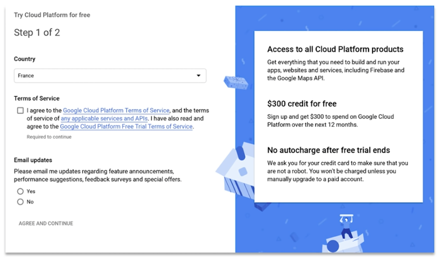
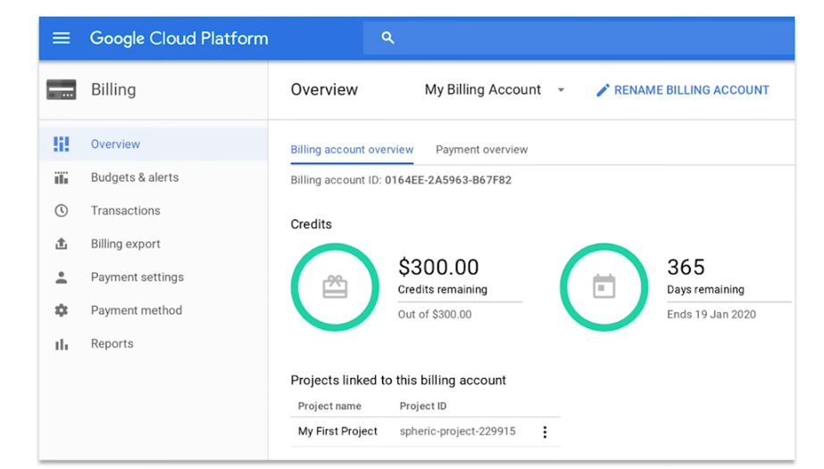

# Create a Minecraft RLCraft server with GCP

In this guide, you will learn to create a RLCraft v2.8.1 server online for free using Google Cloud Platform. 
- How can it be for free ?  

=> Because GCP gives you 300$ free credit for a year, to test their product. You will be able to run your server on it. However, to access the 300$ free credit, GCP asks for a credit card. No money will be charged on this card as long as you have not spent all of your 300$ credit. Google Cloud will paused all running instances once your 300$ credit have been used, and ask if you want to upgrade to a paid account.

Youtube video walkthrough :

1. Create a GCP account and access the 300$ free credit
2. Create Kubernetes Engine, one node with 7.5G RAM and 2 vCPU
3. Access the VM, create path to files to your server
4. Download RLCraft and Forge 1.12.2:2838 server files on the VM
5. Access Cloud Run, get deploy.yaml and "kubectl create -f deploy.yaml"
6. Get the public IP address 
7. Download RLCraft client on Twitch, and Enjoy
8. Do a backup and restore a backup
  
9. Going deeper : how did I get this deploy.yaml

## 1. Create a GCP account and access the 300$ free tier

You will require a gmail address. Create one if you don't have. 
Fill the form to access GCP 300$ credit, as an individual. 
It will require a credit card. 
- https://cloud.google.com/free

Once done, check on GCP that you have gaved access to the 300$ free credit.

More info on GCP free trial : https://www.youtube.com/watch?v=P2ADJdk5mYo

## 2. Create Kubernetes Engine, one node with 7.5G RAM and 2 vCPU

Go to GCP, Kubernetes engine 
Create a cluster 
Select Zonal, and check the nearest zone in :  
- https://cloud.google.com/products/calculator

default-pool > 1 node (instead of 3) 
nodes > Select n1, n1-standard-2, **2 vCPU and 7.5 RAM** 
Create 
Wait a few minuts 

## 3. Access the VM, create path to files to your server

On GCP, go to Compute Engine, and connect in SSH, then execute : 
`sudo su --` 
`cd ..` 
`pwd` 
<aa style="margin-left:20px;">/home</aa> 
`mkdir rlcraft-server` 
`cd rlcraft-server` 
`mkdir data` 
`cd data` 

## 4. Download RLCraft v2.8.1 and Forge 1.12.2:2838 server files on the VM

`pwd` 
<aa style="margin-left:20px;">/home/rlcraft-server/data</aa> 
`wget https://media.forgecdn.net/files/2836/138/RLCraft+Server+Pack+1.12.2+-+Beta+v2.8.1.zip` 
`sudo python`  
`>>> from zipfile import ZipFile` 
`>>> zip_file = ZipFile('/home/rlcraft-server/data/RLCraft+Server+Pack+1.12.2+-+Beta+v2.8.1.zip', 'r')` 
`>>> zip_file.extractall('/home/rlcraft-server/data')` 
`>>> exit()`  
`rm -rf RLCraft+Server+Pack+1.12.2+-+Beta+v2.8.1.zip` 
`wget https://files.minecraftforge.net/maven/net/minecraftforge/forge/1.12.2-14.23.5.2838/forge-1.12.2-14.23.5.2838-installer.jar` 
`wget https://files.minecraftforge.net/maven/net/minecraftforge/forge/1.12.2-14.23.5.2838/forge-1.12.2-14.23.5.2838-universal.jar`  
`cd ..` 
`chmod 777 -R data` 
## 5. Access Cloud Run, get deploy.yaml and "kubectl create -f deploy.yaml"

On GCP, go to Kubernetes Engine, connect to your cluster with Cloud Shell 
`wget https://raw.githubusercontent.com/dleurs/rlcraft/master/deploy.yaml` 
`kubectl create -f deploy.yaml` 
`kubectl get pod` 
`kubectl describe pod release-1-minecraft-5f49ff485d-pv8lq` 
`kubectl logs release-1-minecraft-5f49ff485d-pv8lq --follow` 

## 6. Get the public IP address
`kubectl get service` 

Check how much RAM and CPU the pod is taking: 
`kubectl top pod` 

## 7. Download RLCraft client on Twitch, and Enjoy

### Steps to download RLCraft client, if not already installed :
Download Twitch :  
- https://www.twitch.tv/downloads 

You will require Java 8 (and Oracle force you to create an account to download the jdk) 
- https://www.java.com/fr/download/

Access Twitch, go to mods, Minecraft, Browse modpacks, download RLCraft 
Check that the version is 2.8.1, the same as the server 
 
On the Minecraft Launcher, Edit Profile, in Java Settings :  
Resolution 1600x900 
Make sure *Executable* is pointing to Java 8
For me on macOS, it is :  
`/Library/Java/JavaVirtualMachines/jdk1.8.0_181.jdk/Contents/Home/bin/java`  
JVM Arguments : 
`-Xmx4096m -Xms256m -XX:PermSize=256m -Dfml.ignorePatchDiscrepancies=true -Dfml.ignoreInvalidMinecraftCertificates=true -Duser.language=en -Duser.country=US` 

## 8. Do a backup and restore a backup

### Do a backup :
On GCP, go to Kubernetes Engine, and connect to your cluster using Cloud Shell, then execute : 
`kubectl get pod` 
Copy pod name  
`POD_ID=release-1-minecraft-577889c49d-2xwnp` 
`kubectl exec ${POD_ID} rcon-cli save-off` 
`kubectl exec ${POD_ID} rcon-cli save-all` 
On GCP, go to Compute Engine, and connect in SSH, then execute : 
`sudo su --` 
`cd /home/rlcraft-server/data` 
`now=$(date +'%Y-%m-%d-%Hh%M')` 
`tar -czvf world-${now}.tar world/` 
`cd ..` 
`mkdir backups` 
`mv data/world-${now}.tar backups` 
`cd backups` 
`pwd` 
`ls` 
Click on the gear, download files 

Go back to Kubernetes Engine, and connect to your cluster using Cloud Shell, then execute : 
`kubectl exec ${POD_ID} rcon-cli save-on` 

### Recover a backup :

On GCP, go to Compute Engine, and connect in SSH, then execute : 
`sudo su --` 
`cd /home/rlcraft-server` 
`mkdir backups; cd backups` 
Choose a world, or click on gear and import one from computer
`WORLD=world-2020-03-27-10h02.tar` 
`cd ../data` 
`cp ../backups/${WORLD} .` 
`ls` 

Go to Kubernetes Engine, and connect to your cluster using Cloud Shell, then execute : 
`kubectl get pod --watch` 
`kubectl exec ${POD_ID} rcon-cli stop` 

Go back to Compute Engine : 
`rm -rf world` 
`tar -xzvf ${WORLD}` 
`rm -rf ${WORLD}` 

Not necessary to execute `kubectl exec ${POD_ID} rcon-cli stop`, it will restart automatically

Wait 

## 8. Going deeper : how did I get this deploy.yaml

- https://github.com/helm/charts/tree/master/stable/minecraft
- https://github.com/itzg/docker-minecraft-server

### Steps to get the deploy.yaml

Install helm 3 
`helm repo add stable https://kubernetes-charts.storage.googleapis.com` 
`helm show values stable/minecraft > config.yaml` 
Modify the config file :  
- EULA : true
- put RAM and CPU as needed
- change Liveliness and readiness
- ...  

`helm template -f config.yaml mine-release stable/minecraft > deploy.yaml` 
Modify the deploy.yaml :   
- remove Secret and PersistentVolumeClaim
- in the Deployment, change PersistentVolumeClaim to hostPath (as we are running in a single node, no problem to use hostPath) and provide the path

Forge server download (1.12.2 2838) :
- https://files.minecraftforge.net/maven/net/minecraftforge/forge/index_1.12.2.html

RLCraft server download (1.12.2 v2.8.1) :
- https://www.curseforge.com/minecraft/modpacks/rlcraft/files/2836138